# Report of Ocean Protocol :: Energy Efficiency Data Challenge

## 1. Data cleaning and preprocessing
_More details you can find in the scripts 0_Data_preprocessing.ipynb and 1_Geodata_parsing.ipynb_
- Correct some data types of the features.
- Create new date-time features.
- Remove band features because they are just a groups generated based on the ratings.
- Textual features describing the dwelling we unroll, remove from the initial dataset and analyze separately.
- Parse postcodes, towns, countries from https://www.townscountiespostcodes.co.uk and merge it with input data.

---
## 2. Rankings and correlations

### Number or dwellings by countries (rank number on the map)
#### Countries rankings barplot and the map
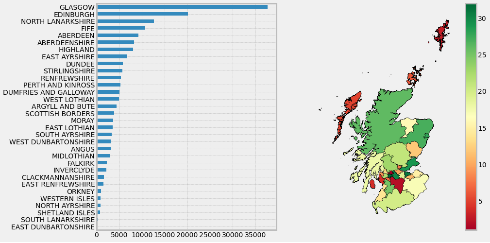
- The most popular regions are in the center part of Scotland like Glasgow or Edinburgh.
- The most unpopular regions are in the north part of Scotland and also regions near the center.

### 2.1. Rank Towns by current efficiency rating
#### Countries rankings barplot and the map
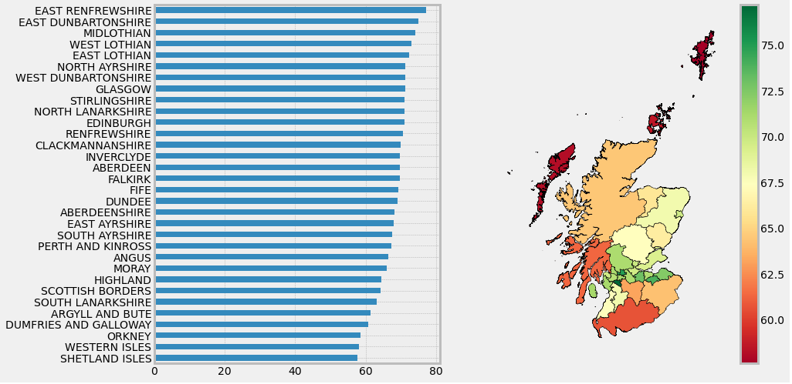
- The most energy efficient regions are concentrated in the center part of Scotland. 
- The least energy efficient regions are in the north part.
#### TOP-10 Town rankings table (len is the number of dwellings in that town and mean is the average value)
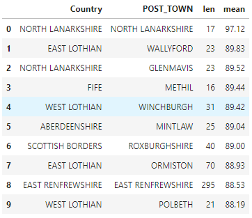

### 2.2. Rank Towns by potential energy efficiency rating
#### Countries rankings barplot and the map
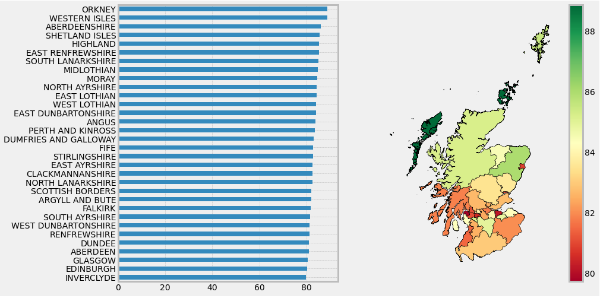
- The most efficient regions are concentrated in the north because they are currently the worst. 
- The least potentially effective regions are in the center part because they are already currently the most effective.
#### TOP-10 Town rankings table (len is the number of dwellings in that town and mean is the average value)
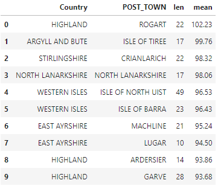

### 2.3. Rank Towns by current environmental impact rating
#### Countries rankings barplot and the map
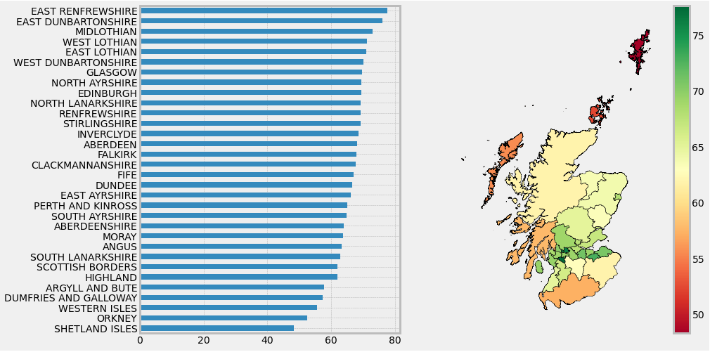
- The most environmental impact regions are concentrated in the center part of Scotland.
- The least currently environmental impact regions are in the north part especially in Shetland isles.
#### TOP-10 Town rankings table (len is the number of dwellings in that town and mean is the average value)
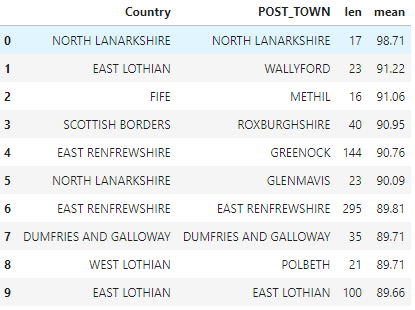

### 2.4. Rank Towns by potential environmental impact rating
#### Countries rankings barplot and the map
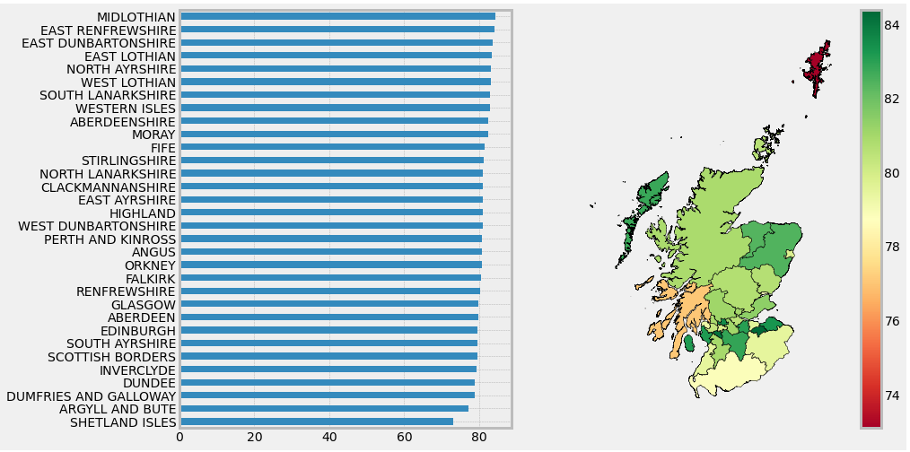
- The most environmental impact regions are concentrated in the center and south part of Scotland.
- The least potentially environmental impact regions are Shetland isles and Argyll and Bute.
#### TOP-10 Town rankings table (len is the number of dwellings in that town and mean is the average value)
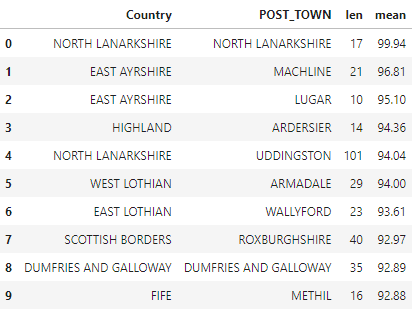

### 2.5. Rank Towns by Current Emissions (T.CO2/yr)
#### Countries rankings barplot and the map
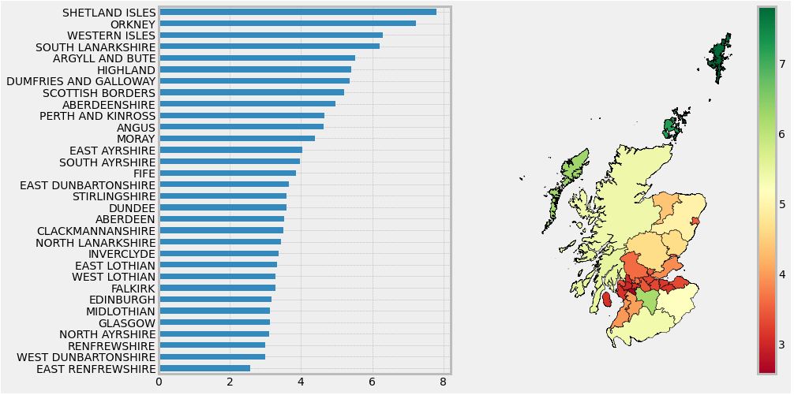
- The most currently polluting in CO2 measurements regions are concentrated in the center part of Scotland. 
- The least currently polluting in CO2 measurements regions are in the north part.
#### TOP-10 Town rankings table (len is the number of dwellings in that town and mean is the average value)
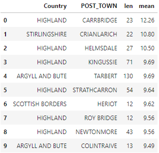

### 2.6. Rank Towns by Potential Reduction in Emissions (T.CO2/yr)
#### Countries rankings barplot and the map
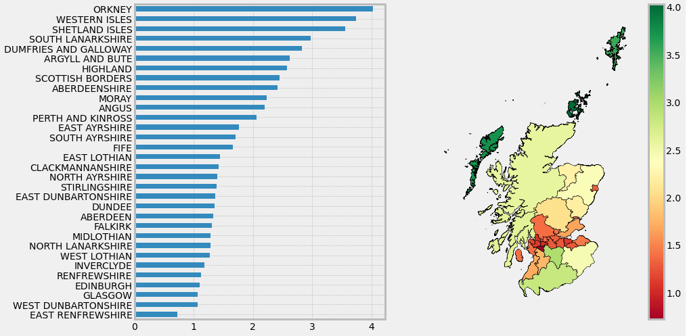
- The most potentially polluting in CO2 measurements regions are concentrated in the center part of Scotland. 
- The least potentially polluting in CO2 measurements regions are in the north part.
#### TOP-10 Town rankings table (len is the number of dwellings in that town and mean is the average value)
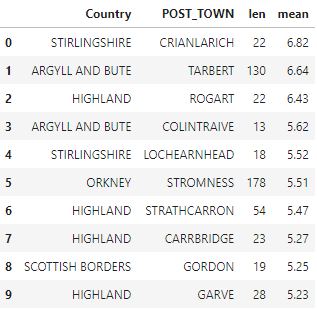

### 2.7. Rank Towns by potential savings in heating costs (£) over three years
#### Countries rankings barplot and the map
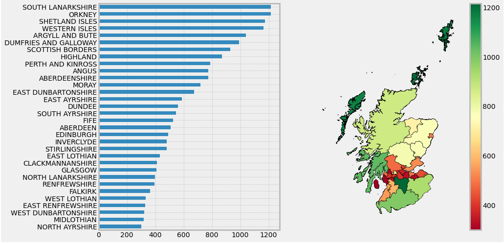
- The best regions by potential savings in heating costs are in the north and south part of Scotland.
- The least regions by potential savings in heating costs are in the center part of Scotland.
#### TOP-10 Town rankings table (len is the number of dwellings in that town and mean is the average value)
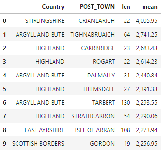

### 2.8. Rank Towns by potential savings in hot water costs (£) over three years
#### Countries rankings barplot and the map
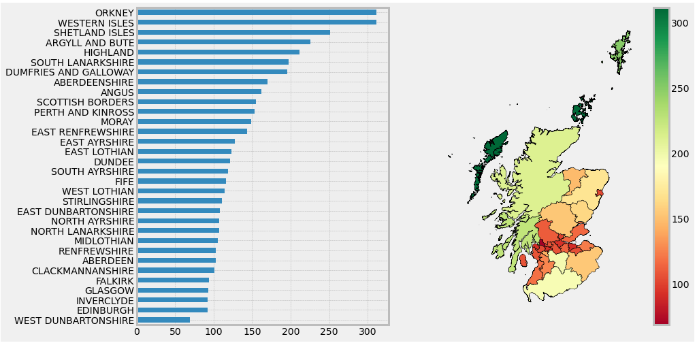
- The best regions by potential savings in hot water costs are in the north part of Scotland. 
- The least regions by potential savings in hot water costs are in the center part of Scotland. 
#### TOP-10 Town rankings table (len is the number of dwellings in that town and mean is the average value)
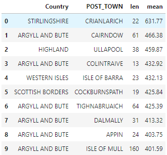

### 2.9. Rank the top 5 wall descriptions (wall materials) by CO2 emissions current per floor area and wall energy efficiency (create a single rating combining CO2 emissions and wall energy efficiency)
- We have transformed the unique wall description values to Wall Type and Wall Insulation features (more details you can find in the script).
- We have created CO2 rating based on the relevant CO2 values (inverse dependency and values from 1 to 5) 
- Wall rating have been created from the WALL_ENERGY_EFF field with replacing of the word rankings to the values: 
    -very poor: 1,
    -poor: 2,
    -average: 3,
    -good: 4,
    -very good: 5
- Total rating is the simple average between wall and CO2 ratings.
#### Features popularity
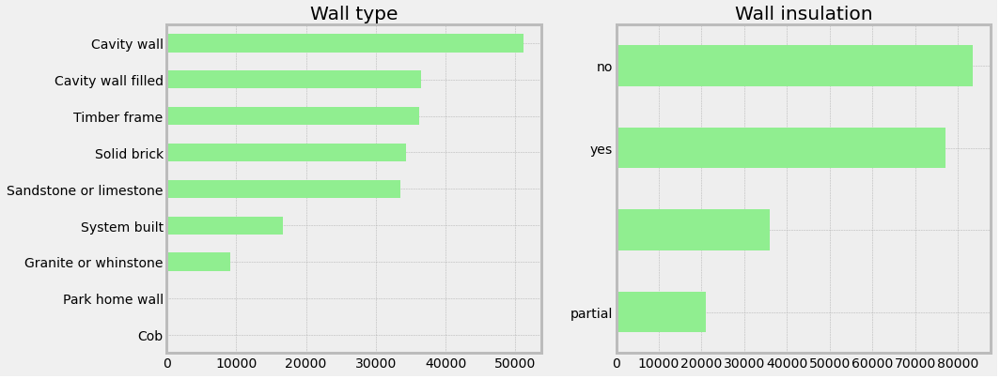
#### Features average ratings
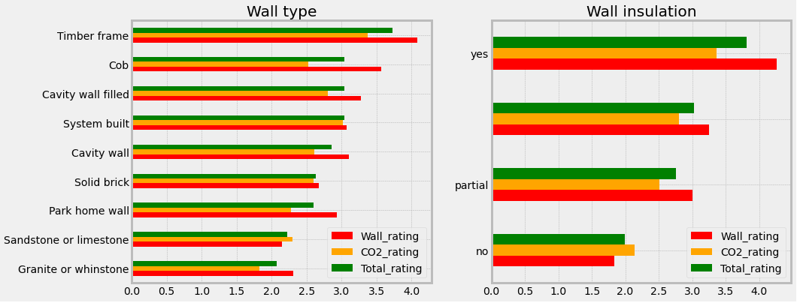
#### Features heatmaps (Wall Type on Wall Insulation)
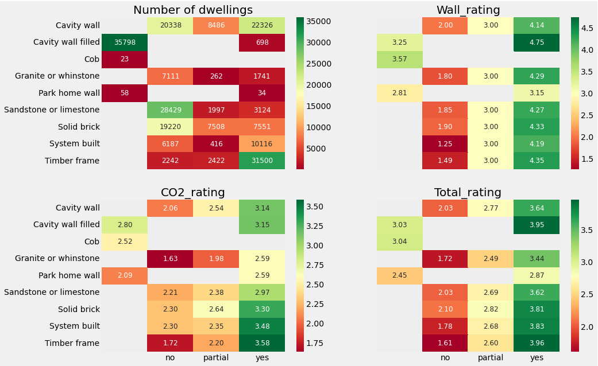

### 2.10. Rank the top 5 roof descriptions (roof materials) by CO2 emissions current per floor area and roof energy efficiency (create a single rating combining CO2 emissions and roof energy efficiency)
- We have transformed the unique roof description values to Roof Type and Roof Insulation features (more details you can find in the script).
- We have created CO2 rating based on the relevant CO2 values (inverse dependency and values from 1 to 5) 
- Wall rating have been created from the ROOF_ENERGY_EFF field with replacing of the word rankings to the values: 
    -very poor: 1,
    -poor: 2,
    -average: 3,
    -good: 4,
    -very good: 5
- Total rating is the simple average between roof and CO2 ratings.
#### Features popularity
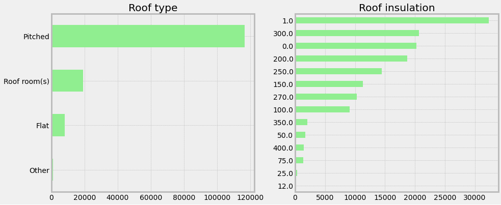
#### Features average ratings
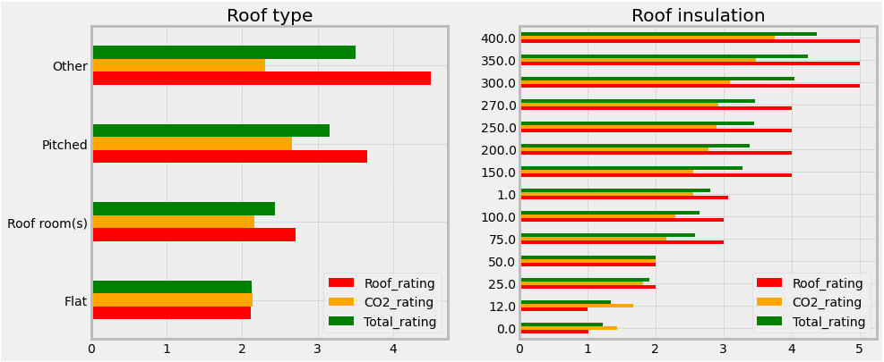
#### Features heatmaps (Wall Type on Wall Insulation)

---
## 3. Algorithms

### 3.1. Build an algorithm to find correlations between CO2 emissions current per floor area vs wall description and wall energy efficiency
- Create a splittings by the unique combinations of cleaned features values. Wall description and wall energy efficiency in our case have transformed into 3 features: WALL_TYPE, WALL_INS, Wall_rating. Collect CO2 emissions current per floor area values in each group.
- If in one of the group we have less then 100 observations let's replace them as OTHER. In total we have received 56 unique number of groups. 
- Plot box-plot to have ability to vizual compare distributions of CO2 values in each group. On the picture below we can see that there is a strong differences between distributions of that feature in the groups.
- Conduct ANOVA statistical test to have numerical value of similarity between these variables. We calculated F_statistics = 1244.40 and pvalue = 0 and can conclude that there is high dependance between these features.
#### Boxplots of CO2 values by the groups:
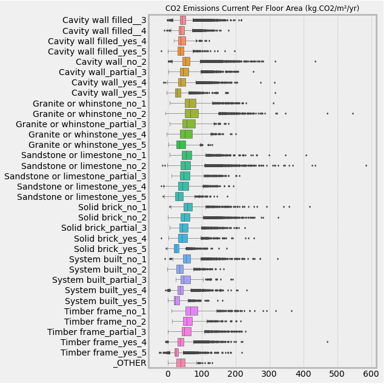

### 3.2. Build an algorithm to find correlations between CO2 emissions current per floor area vs roof description and roof energy efficiency
- Create a splittings by the unique combinations of cleaned features values. Roof description and roof energy efficiency in our case have transformed into 3 features: ROOF_TYPE, ROOF_INS, Roof_rating. Collect CO2 emissions current per floor area values in each group.
- If in one of the group we have less then 100 observations let's replace them as OTHER. In total we have received 36 unique number of groups. 
- Plot box-plot to have ability to vizual compare distributions of CO2 values in each group. On the picture below we can see that there is a strong differences between distributions of that feature in the groups.
- Conduct ANOVA statistical test to have numerical value of similarity between these variables. We calculated F_statistics = 1153.09 and pvalue = 0 and can conclude that there is high dependance between these features.
#### Boxplots of CO2 values by the groups:
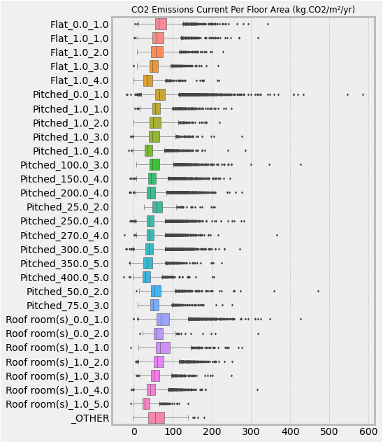

### 3.3. Build an algorithm to find correlations between construction age band vs current energy efficiency and current emissions (T.CO2/yr)
- Convert age band to it's maximum value in the range to have the numerical feature
- Calculate average features values of each age construction group.
- Draw points to vizually understand the dependancies.
- Calculate Pearson correlation coefficient between feature and age value.
#### Correlation coefficients with construction age and features:
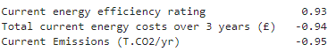
#### Dependencies of average feature value by construction age:
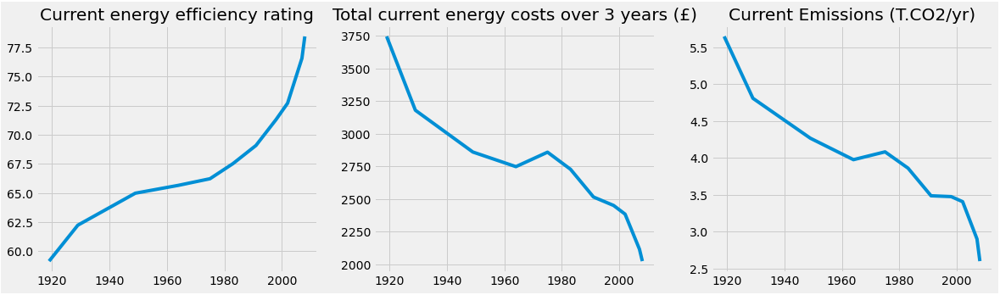

### 3.4. Build an algorithm that takes as input the characteristics of a building (any field of the dataset) and outputs recommendations on the elements of the house to be modified to improve its energy performance
- Preprocess input features and choose not duplicated and potentially usefull for recommendation model.
- Remove features that cannot be improved by the owner of a particular dwelling. For example, we cannot change the city of the building or the year of construction, but CO2 Emissions, for example, we can.
- Numerical features transform to categorical feature with 10 buckets based on percentiles.
- In each categorical feature value we calculate average value of a target variable.
- Let's suppose that the owner can improve his feature only on the one bucket. Based on that assumption calculate the maximum target improvement of that user.
#### Heatmap of the average energy performance value by the bucket number (1-10) and the input features:

### 3.5. Build an algorithm that takes as input the characteristics of a building (any field of the dataset except those related to costs) and outputs the total cost of energy of the building over a 3-year period
_More details you can find in the script Modelling_cost.ipynb_
- Create validation set as 20% random sample from initial dataset.
- Preprocess input features and choose not duplicated and potentially usefull for modeling.
- Train Boosting models (Xgboost, LightGBM) and Random Forest model.
- Evaluate models on the validation set by the following metrics: mean absolute error, mean squared error, mean absolute percentage error, symmetric mean absolute percentage error.
#### As we can see in the table below all models give us sufficiently good resuls:
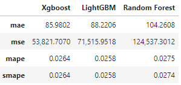
#### Feature importances of Xgboost model:
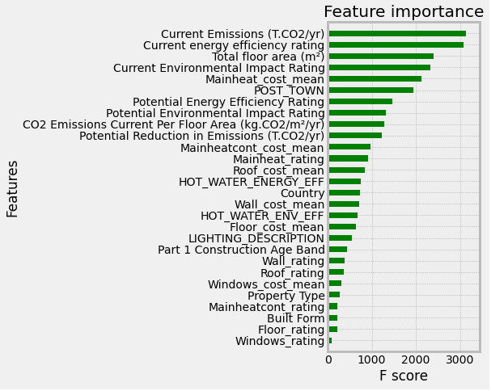
#### Feature importances of Random Forest model:
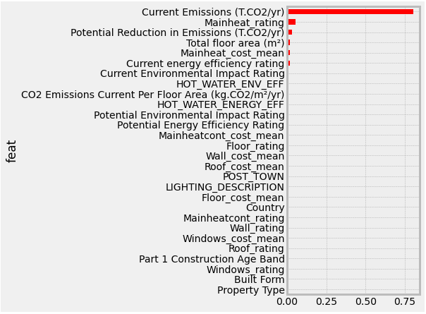
#### Feature importances of LightGBM model:
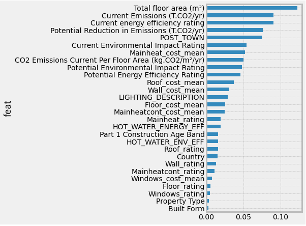

### 3.6. Build an algorithm that takes as input the characteristics of a building (any field in the dataset) and outputs recommendations on which elements of the house should be modified to most effectively decrease the total energy cost of the building over a 3-year period
- Preprocess input features and choose not duplicated and potentially usefull for recommendation model.
- Remove features that cannot be improved by the owner of a particular dwelling. For example, we cannot change the city of the building or the year of construction, but CO2 Emissions, for example, we can.
- Numerical features transform to categorical feature with 10 buckets based on percentiles.
- In each categorical feature value we calculate average value of a target variable.
- Let's suppose that the owner can improve his feature only on the one bucket. Based on that assumption calculate the maximum target improvement of that user.
#### Heatmap of the average energy cost value by the bucket number (1-10) and the input features:
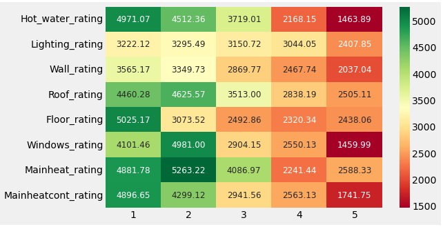